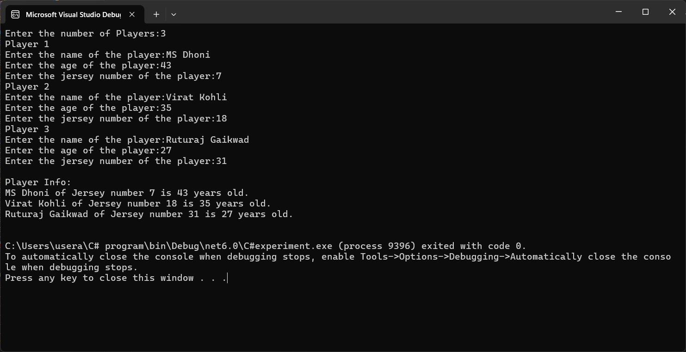
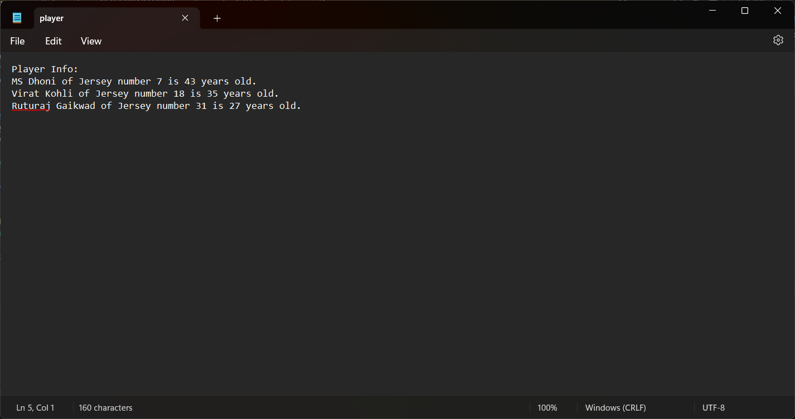

# 19AI308-Object-Oriented-Programming-using-CSharp-Exp-10-File-Manipulation
Develop a C# program to get the values from the user using structure and store it in a file in a specific path using file stream concept
# AIM:
To develop a C# program using file streams.

# ALGORITHM:
## Step 1:
Prompt user for the number of players, store the input.

## Step 2:
Create an array of Player structs based on the user input.

## Step 3:
Iterate through each player, prompting for name, age, and jersey number.

## Step 4:
Specify the file path for storing player information.

## Step 5:
Open a StreamWriter to the file and append player details.

## Step 6:
Iterate through player array, writing each player's details to the file.

## Step 7:
Close the StreamWriter, then display the contents of the file to the user.

# PROGRAM:
Developed By:SETHUKKARASI C<br>
Register Number:212223230201

```
using System;
using System.IO;
using System.Linq;
using System.Text;
using System.Threading.Tasks;
struct Player
{
    public string name;
    public int age;
    public int jersey_number;
};
public class Program
{
    public static void Main(string[] args)
    {
        int num;
        Console.Write("Enter the number of Players:");
        num = Convert.ToInt32(Console.ReadLine());
        Player[] p = new Player[num];
        for(int i=0;i<num;i++)
        {
            Console.WriteLine("Player " + (i+1));
            Console.Write("Enter the name of the player:");
            p[i].name = Console.ReadLine();
            Console.Write("Enter the age of the player:");
            p[i].age = Convert.ToInt32(Console.ReadLine());
            Console.Write("Enter the jersey number of the player:");
            p[i].jersey_number = Convert.ToInt32(Console.ReadLine());
        }
        string path = @"C:\Users\usera\OneDrive\Desktop\C#\player.txt";
        using (StreamWriter sw = File.AppendText(path))
        {
            for(int j=0;j<num;j++)
            {
                sw.WriteLine(p[j].name + " of Jersey number " + p[j].jersey_number + " is " + p[j].age + " years old.");
            }
            sw.Close();
            Console.WriteLine(" ");
            Console.WriteLine(File.ReadAllText(path));
        }
    }
}
```
# OUTPUT:



# RESULT:
Thus, a C# program using file streams is developed, executed and verified successfully.